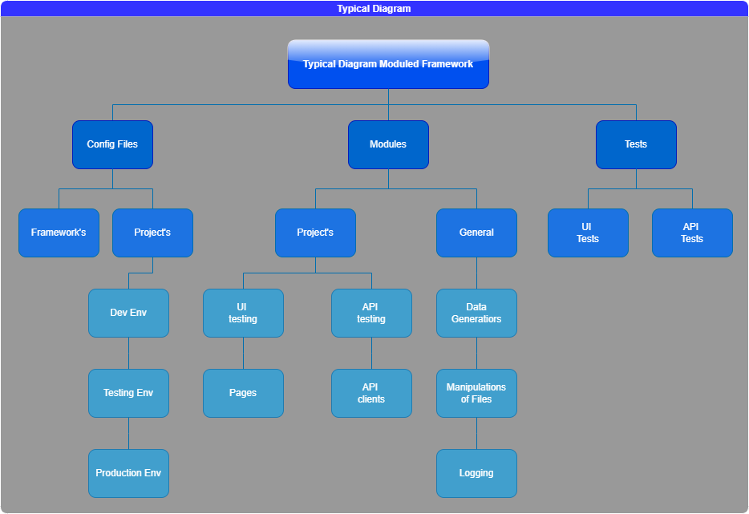

## Structure and Pipeline of Framework

**The main components of the Framework:**

- Configuration files
- Modules
- Tests
---
**Generic modules** are those that perform generic actions, e.g
write data to a text file. That is, they are not written
specifically for your product.
---
**Project modules** are those that are created exclusively for
testing your product.
---

## How to use this Framework? 

The main idea is the pipline: 
---
1. Define module with class that must do what do you need.
2. Write tests for this module in the folder `tests\..\test_*.py`
3. Registrate pytest.marks, write `fixtures` if you're needing and make changes in configuration `*.yaml` file.
4. Run tests! `pytest -m your_mark`

## Structure of the Framework

    QA-Framework/
    ├── become_qa_auto.db
    ├── config
    │   ├── __init__.py
    │   ├── config.py
    │   └── config.yaml
    ├── conftest.py
    ├── modules
    │   ├── api
    │   │   └── clients
    │   │       ├── __init__.py
    │   │       └── github.py
    │   ├── common
    │   │   ├── __init__.py
    │   │   └── database.py
    │   └── ui
    │       └── page_objects
    │           ├── __init__.py
    │           ├── base_page.py
    │           └── sign_in_page.py
    ├── pytest.ini
    └── tests
        ├── api
        │   ├── test_api.py
        │   ├── test_fixtures.py
        │   ├── test_github_api.py
        │   └── test_http.py
        ├── database
        │   └── test_database.py
        └── ui
            ├── test_ui.py
            └── test_ui_page_object.py
